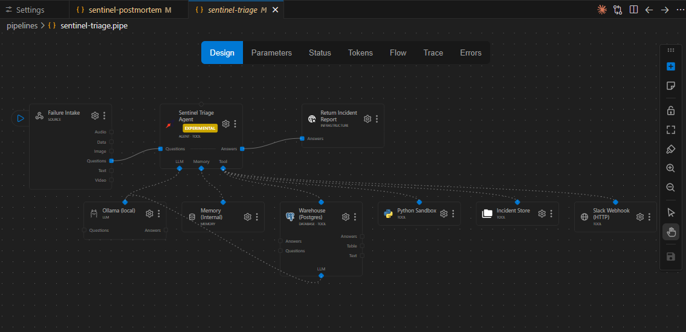
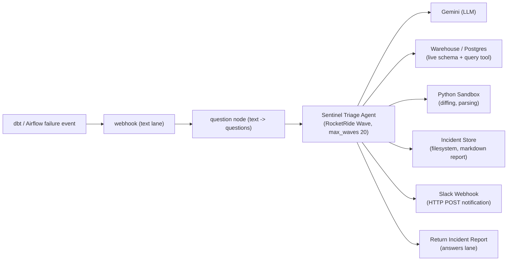
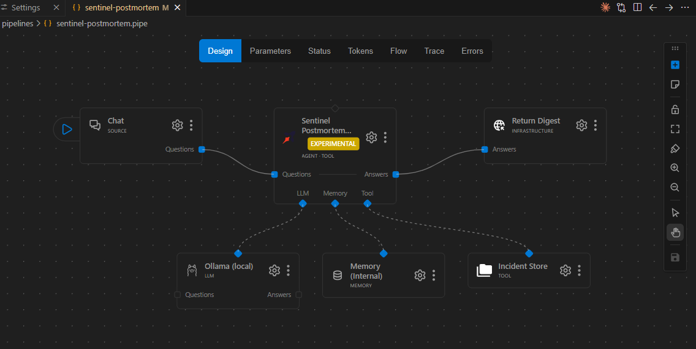
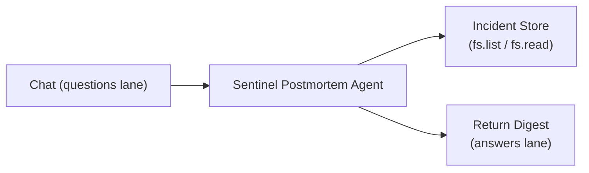
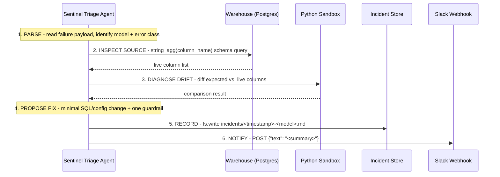

<div align="center">

<h1>Sentinel</h1>

<p><em>An on-call incident triage agent for data pipelines that reads the warehouse instead of the alert.</em></p>

Built by [Mayuresh Pandey](https://github.com/mayu99) &middot; previous RocketRide build: [Loop](https://github.com/mayu99/Loop) (HackWithBay3)

<br/>


</div>

---

When a dbt or Airflow job fails at 3am, an on-call data engineer spends 30&ndash;60 minutes grepping logs, checking whether an upstream table changed, and writing up an incident. Sentinel does that automatically: it receives the failure event, inspects the **live warehouse schema** to find the root cause, writes an incident report, and notifies the team &mdash; all as RocketRide pipelines.

> **In one sentence:** A dbt/Airflow failure fires a webhook, a RocketRide agent inspects the live warehouse schema to determine the root cause itself &mdash; never the payload alone &mdash; proposes a concrete fix, writes an incident report, and notifies the team, entirely self-hosted.

## The Problem

- **The 3am grind is mechanical, not hard.** Reading an error, checking whether an upstream table drifted, and writing it up is the same three steps every time &mdash; and it eats 30&ndash;60 minutes per incident that a human spends half-asleep.
- **The root cause is rarely in the error message.** A `column does not exist` error names the missing column; it doesn't say what replaced it. That answer lives in the live schema, and someone has to go query it.
- **Undocumented incidents repeat.** Without a structured write-up, "have we seen this pattern before?" means re-reading a pile of Slack threads.

## The Solution

Sentinel automates the mechanical part &mdash; fetch live schema, diff against what the model expects, write it down &mdash; and leaves the review and the fix-shipping to a human. It ships as two composable RocketRide pipelines: an event-driven triage agent, and an on-demand postmortem agent that reads the triage agent's own incident reports back and synthesizes a digest.

### The thesis

Warehouse credentials cannot leave the network. An incident triage agent that needs live schema access therefore cannot be a hosted SaaS product that phones home &mdash; the runtime has to be self-hostable, running inside the same network boundary as the warehouse. That is not a nice-to-have; it is the only viable architecture for this class of tool.

Sentinel runs entirely self-hosted: engine, warehouse, and pipelines all local. The LLM node is the only outbound dependency, and it is swappable.

## Demo

<div align="center">

<a href="https://youtu.be/A4dtzbJncB0">
  
</a>

**Watch the demo:** [https://youtu.be/A4dtzbJncB0](https://youtu.be/A4dtzbJncB0)

</div>

### The scenario

An upstream team renames `customer_email` to `email` in `public.customers` (and adds `email_verified`). The dbt model `stg_customers.sql` still selects `customer_email`, so the nightly run fails and the downstream model `fct_orders` is skipped. Sentinel receives the failure event and has to work out why &mdash; it is not told.

### Architecture

<p align="center"></p>



A second, on-demand pipeline reads the incident reports the triage agent writes and answers questions about them:

<p align="center"></p>



### The triage protocol

The agent follows a fixed six-step protocol on every run:



## The Hard Rule

The agent is never told the answer. The failure payload contains the failing column name and the error, but nothing about what replaced it. The agent must query the live warehouse to find out.

This was enforced the hard way: the original payload carried a Postgres `HINT: Perhaps you meant to reference the column "customers.email"` line, which leaked the answer directly. It was removed. Do not reintroduce it &mdash; see [`TROUBLESHOOTING.md`](TROUBLESHOOTING.md#6-agents-root-cause-looks-suspiciously-like-it-just-read-the-error-message).

## The Falsification Test

This is the strongest evidence in the repo. Rename the column in the warehouse and re-run. If the agent were paraphrasing the payload, its diagnosis would not change. It does:

```bash
docker exec sentinel-warehouse psql -U sentinel -d warehouse -c \
  "ALTER TABLE customers RENAME COLUMN email TO contact_email"
python scripts/fire_failure.py
docker exec sentinel-warehouse psql -U sentinel -d warehouse -c \
  "ALTER TABLE customers RENAME COLUMN contact_email TO email"
```

Verified result &mdash; the agent's report named `contact_email`, a string that appears nowhere in the payload:

```
## Evidence
Upstream columns in `public.customers`: customer_id, full_name, contact_email,
email_verified, signup_source, created_at, _loaded_at
## Root Cause
Upstream table `public.customers` renamed `customer_email` to `contact_email`;
`stg_customers.sql` still selects `customer_email`.
```

The committed artifact is [`demo/sample_output/falsification-test-contact_email.md`](demo/sample_output/falsification-test-contact_email.md).

## Verified Results

| Metric | Value |
|---|---:|
| Consecutive end-to-end runs | 7 |
| Correct diagnoses | 7 / 7 |
| Notifications delivered | 7 / 7 |
| Trace errors, final configuration | 0 |
| Typical run time | 22&ndash;35 seconds |
| Typical tool calls per run | 25&ndash;65 |
| Wave loops per run | 1 |
| Fastest clean run | 6.7 seconds, 29 tool calls |

The agent also self-corrects malformed tool calls within the wave loop and still completes successfully &mdash; a real property of the runtime worth stating, not hiding.

> Notifications are delivered over HTTP POST and verified at the receiving end. The demo posts to a `webhook.site` endpoint rather than a live Slack channel &mdash; the request shape is identical, and pointing it at a real incoming webhook is a one-line change. See [Getting Started](#getting-started) and [What This Is NOT Claiming Yet](#what-this-is-not-claiming-yet).

## Key Features

- **Self-hosted end-to-end.** Engine, warehouse, and pipelines all run locally. The LLM node is the only outbound dependency, and it's a single swappable node.
- **Live-schema-grounded diagnosis.** The agent is structurally prevented from parroting the payload &mdash; see [The Hard Rule](#the-hard-rule).
- **A falsifiable claim, not a demo trick.** Rename the column, re-run, watch the diagnosis follow &mdash; see [The Falsification Test](#the-falsification-test).
- **Two composable pipelines.** An event-driven triage agent and an on-demand postmortem agent that reads the first agent's own output.
- **Self-correcting tool loop.** Malformed tool calls get corrected mid-wave without failing the run.
- **Full audit trail.** Every incident is a timestamped markdown file with a dedicated Evidence section, so a human (or the postmortem agent) can verify the claim instead of trusting it blindly.

## Tech Stack

| Layer | Tech |
|---|---|
| Pipeline runtime | RocketRide (self-hosted engine, Development &rarr; Local mode) |
| Warehouse | PostgreSQL 16 in Docker (`sentinel-warehouse`, port 5544) |
| Reasoning LLM | Google Gemini via the `custom` model profile |
| Present, deliberately unwired | Ollama &mdash; proof the LLM is one swappable node, not load-bearing |
| Pipeline under triage | dbt |
| Scripting / OS | Python 3, PowerShell 5.1, Windows |

> Sentinel runs entirely self-hosted &mdash; engine, warehouse, and pipelines all local. The LLM node is provider-agnostic; this demo was recorded with a hosted model because 8B CPU inference at ~3 tok/s cannot sustain a multi-wave tool loop on a laptop without a GPU. On a GPU host, swap one node back to Ollama and nothing else changes.

## Getting Started

1. **Start the demo warehouse:**
   ```bash
   cd demo && docker compose up -d
   ```
2. **Seed it.** PowerShell has no `<` input redirection, so pipe the file in instead:
   ```powershell
   Get-Content demo\seed.sql | docker exec -i sentinel-warehouse psql -U sentinel -d warehouse
   ```
3. **Set the RocketRide Variables panel entries:**
   `ROCKETRIDE_PG_HOST`, `ROCKETRIDE_PG_DB`, `ROCKETRIDE_PG_USER`, `ROCKETRIDE_PG_PASSWORD`, `ROCKETRIDE_GEMINI_KEY`, `ROCKETRIDE_SLACK_WEBHOOK`.

   **Note:** `${VAR}` interpolation only fires on node CONFIG fields, not on agent instruction text (see [`TROUBLESHOOTING.md`](TROUBLESHOOTING.md#9-rocketride_slack_webhook-in-agent-instructions-doesnt-interpolate)) &mdash; so setting `ROCKETRIDE_SLACK_WEBHOOK` here does not, by itself, change where step 6 (NOTIFY) posts. The target URL is hardcoded directly into the agent's instructions in `pipelines/sentinel-triage.pipe`. To point notifications at your own endpoint, edit that URL in the agent's step 6 instruction text on the canvas.
4. **Open and run the pipeline:** load `pipelines/sentinel-triage.pipe` in the RocketRide VS Code canvas and start it. The Project Log prints the webhook URL.
5. **Fire the failure:**
   ```bash
   export SENTINEL_WEBHOOK_URL=<webhook_url_from_project_log>
   export SENTINEL_API_KEY=<your RocketRide API key>
   python scripts/fire_failure.py
   ```
6. **Run the postmortem:** start `pipelines/sentinel-postmortem.pipe`, open its chat, and ask for a digest.

**Before any of this** &mdash; a fresh clone will hit the `onnxruntime-gpu==1.20.1` engine-startup bug immediately. Read [`TROUBLESHOOTING.md`](TROUBLESHOOTING.md) first; it covers that and nine other walls this build actually hit.

## What This Is NOT Claiming Yet

Honest framing matters more than a flashy demo:

- **One scenario, not a general triage agent.** Sentinel handles column-rename schema drift. It has not been tested against type changes, permission errors, timeouts, constraint violations, or upstream data-quality failures.
- **The demo warehouse is a toy.** Seven columns, four rows, one failing model.
- **RocketRide's `postgres.get_schema` reflects a one-time snapshot taken at engine startup**, not live state (`db_global_base.py:494`: `self.db_schema` is set once and never reassigned) &mdash; DDL applied after startup is invisible to it until restart. Sentinel works around this by querying `information_schema.columns` directly with a server-side `string_agg` instead of relying on `get_schema` &mdash; that's a real constraint of the runtime, not a solved problem.
- **Notifications are delivered over HTTP POST and verified at the receiving end; the demo target is `webhook.site`, not a live Slack channel.** `${VAR}` interpolation only fires on node CONFIG fields, not on agent instruction text (see [`TROUBLESHOOTING.md`](TROUBLESHOOTING.md#9-rocketride_slack_webhook-in-agent-instructions-doesnt-interpolate)), so the notify step's target URL is hardcoded in the agent's instructions (step 6, NOTIFY &mdash; see [Getting Started](#getting-started)) rather than sourced from `${ROCKETRIDE_SLACK_WEBHOOK}`. The tool is whitelisted for both `hooks.slack.com` and `webhook.site`; the request shape is identical either way, and pointing it at a real incoming webhook is a one-line edit &mdash; it just hasn't been run against one yet.
- **RocketRide's agent node is badged EXPERIMENTAL by the vendor.**
- **No retroactive trace API.** Traces exist only as a live WebSocket stream during a run. There is no run history, no dead-letter queue, and no replay.
- **Proposed fixes are not applied.** Sentinel diagnoses and recommends; a human still opens the PR. No write path to the dbt repo exists.
- **Gemini free tier caps at 20 requests/day, per project, per model** &mdash; roughly two runs. This is a demo-scale constraint, not a production one.

## Roadmap

1. Applying fixes as PRs rather than recommendations.
2. More failure classes beyond column renames.
3. A trace ingester that persists the WebSocket stream so runs have history.
4. A console UI over the incident store.
5. Running the agent against a real warehouse.

## Acknowledgements

- **[RocketRide](https://docs.rocketride.org)** &mdash; the self-hosted pipeline runtime the whole system is built on.
- **[Google Gemini](https://ai.google.dev)** &mdash; the reasoning LLM for the recorded demo.
- **[dbt](https://www.getdbt.com)** &mdash; the pipeline framework Sentinel triages failures for.
- **[PostgreSQL](https://www.postgresql.org)** &mdash; the demo warehouse.

## License

No `LICENSE` file is committed to this repository yet. Until one is added, all rights are reserved by the author.
